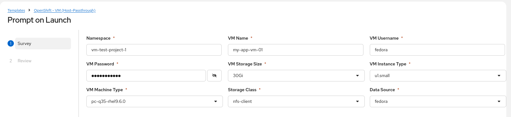
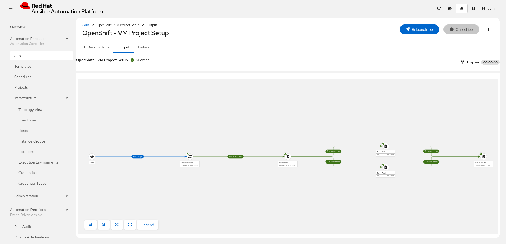

# OpenShift Configuration Playbook

This repositories provide examples for OpenShift configuration using Ansible.

Some of the playbooks here support input variables while some will just provide static/hardcoded configurations.
You should use Ansible Automation Platform (AAP) Job Template survey or extra vars for the dynamic inputs.

## Authentication ##

In Ansible Automation Platform, we can use built-in Credential Type: OpenShift or Kubernetes API Bearer Token.
The token can be viewed from OpenShift Console. Use the 'Copy login command' page to get the token.

```yaml
endpoint: 'https://api.yourdomain:6443'
breartoken: 'pasteyourtoken'
```

Alternatively, you can create a kubeconfig custom credential type.
You will need to get your kubeconfig data string.

Input configuration
```yaml
fields:
  - id: kube_config
    type: string
    label: kubeconfig
    secret: true
    multiline: true
```

Injector configuration
```yaml
env:
  K8S_AUTH_KUBECONFIG: '{{ tower.filename.kubeconfig }}'
file:
  template.kubeconfig: '{{ kube_config }}'
```

## Execution Environment ##

The ansible collection module **redhat.openshift** is present on Red Hat's default supported EE image.

Example image 
```
registry.redhat.io/ansible-automation-platform-25/ee-supported-rhel9:latest
```

## Playbooks List ##

| File Name | Purpose |
|--|--|
| ocp-app/deploy_service_web.yaml | Create Service for Web (TCP/8080) |
| ocp-rbac/rbac_role_static.yaml | Create hardcoded RoleBindings |
| ocp-rbac/rbac_role_vm_(admin/editor).yaml | Create RoleBinding for VM Admin / Editor |
| ocp-rbac/rbac_user_group.yaml | Create User Groups from a list |
| ocp-virtualization/deploy_namespace.yaml | New Namespace Configuration |
| ocp-virtualization/deploy_vm_host_passthrough | Create a VM with host-passthrough CPU |
| ocp-virtualization/deploy_cudn_static.yaml | Create hardcoded CUDN |
| ocp-virtualization/deploy_nncp_static.yaml | Create hardcoded NNCP |

Example Job Template Survey for VM Deployment




## Workflow Example ##

Simple workflow setup:
1. Project Sync
2. Create Namespace
3. Create RoleBinding for the Namespace
4. Create VM to test deployment



## AAP Operator Deployment ##

This is a simple AAP 2.6 Custom Resource for AAP deployment using OpenShift Operator.

```yaml
---
apiVersion: aap.ansible.com/v1alpha1
kind: AnsibleAutomationPlatform
metadata:
  name: aap
  namespace: aap
spec:
  # Platform
  image_pull_policy: IfNotPresent

  database:
    resource_requirements:
      requests:
        cpu: 200m
        memory: 512Mi
    storage_requirements:
      requests:
        storage: 100Gi

  controller:
    disabled: false

  eda:
    disabled: false

  hub:
    disabled: false
    storage_type: file
    file_storage_storage_class: rwx-file-storage-name
    file_storage_size: 100Gi
```

## OpenShift Bearer Token for AAP ##

Instead of refreshing human user login token every time and update AAP Credential, it is recommended to create a service account bearear token that will live for 1 year (31536000 seconds).

```bash
# Create Service account on the AAP namespace
$ oc project aap
$ oc create serviceaccount aap-admin
serviceaccount/aap-admin created

# Assign cluster-admin role
$ oc adm policy add-cluster-role-to-user cluster-admin \
  system:serviceaccount:aap:aap-admin
clusterrole.rbac.authorization.k8s.io/cluster-admin added: "system:serviceaccount:aap:aap-admin"

# Create 1 year token
$ cat <<EOF | oc apply -f -
apiVersion: v1
kind: Secret
metadata:
  name: aap-admin-token
  namespace: aap
  annotations:
    kubernetes.io/service-account.name: aap-admin
    kubernetes.io/token-expiration-seconds: "31536000"
type: kubernetes.io/service-account-token
EOF
secret/aap-admin-token created

# Retreive token
$ oc get secret aap-admin-token \
  -o jsonpath='{.data.token}' | base64 -d
eyJhbGc...truncated...xKnMVE_9Y

# Verify token
$ TOKEN=$(oc get secret aap-admin-token \
  -o jsonpath='{.data.token}' | base64 -d)
$ oc whoami --token=$TOKEN
system:serviceaccount:aap:aap-admin
```